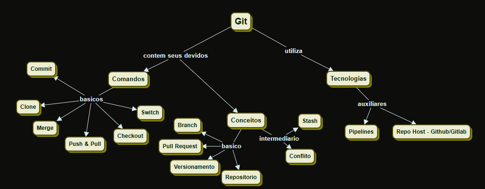
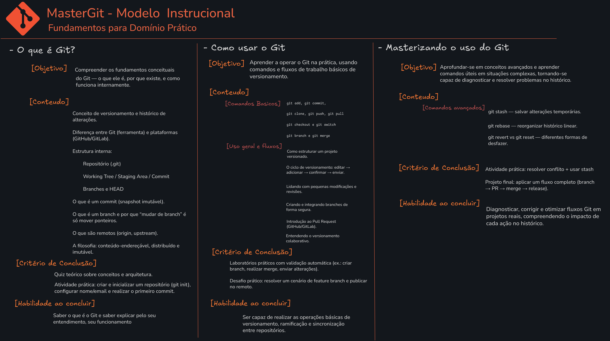

# MasterGit: Aprendizagem sobre Versionamento com uso da tecnologia Git

**Objetos de Aprendizagem — Mestrado**  
**Autor:** Felipe Augusto Medici de Oliveira — _RA 2458772_  
**Proposta de Objeto de Aprendizagem (OA)**

---

## Objetivo do sistema:

Sistema para aprendizagem do controle de git. Onde o usuario ve seu progresso pelos modulos e atua com testes e validacoes do seu progresso.

## Mapa Conceitual (CMAP):

_No cmap - pasta /grupo33_


## Modelo Instrucional:



## Objetivos Educacionais

O **MasterGit** é um objeto de aprendizagem (OA) interativo para desenvolvimento de domínio **conceitual e prático** do Git como sistema de controle de versão distribuído.

### Público-Alvo

**Primário:**

- Estudantes de **Computação** (Ciência da Computação, Engenharia de Software)
- Estudantes de **Engenharias** (Elétrica, Mecatrônica, Produção) com foco em automação
- **Profissionais de desenvolvimento** iniciantes e intermediários
- **Pesquisadores** que necessitam de controle de versão para experimentos

**Secundário:**

- Analistas de sistemas e QA
- Gerentes de projeto técnicos
- Estudantes de pós-graduação em áreas correlatas

**Pré-requisitos:**

- ✅ Noções básicas de linha de comando (CLI)
- ✅ Conhecimento básico de sistemas operacionais
- ✅ Experiência mínima com editores de texto/código

### Requisitos de Aprendizagem

Ao concluir o **MasterGit**, o estudante será capaz de:

#### **Competências Conceituais**

- Explicar o **modelo mental do Git** (objetos, commits, branches, HEAD, working tree, index)
- Diferenciar e aplicar `git checkout`, `git switch` e `git restore` adequadamente
- Compreender **estratégias de branching** (Git Flow, GitHub Flow, Trunk-Based)

#### **Competências Práticas**

- Aplicar **fluxos de branching** (feature, release, hotfix) com segurança
- Diagnosticar e resolver **conflitos de mesclagem** documentando o raciocínio
- Projetar **estratégias de versionamento** adequadas a contextos específicos
- Operacionalizar **colaboração**: pull requests, code reviews, semantic commits

#### **Competências Avançadas**

- Avaliar **riscos e trade-offs** de decisões de versionamento
- Garantir **reprodutibilidade** de experimentos científicos com branches e tags
- Implementar **automação de releases** e changelogs
- Auditar históricos de commits para conformidade e qualidade

---

## - Como Rodar o Projeto:

### Pré-requisitos

- Node.js (versão 16 ou superior)
- Yarn ou npm

### Instalação e Execução

```bash
# Instalar dependências
yarn install

# Executar em modo desenvolvimento
yarn dev

# Build para produção
yarn build
```

## 📖 Documentação Completa

Para requisitos detalhados, consulte: [`requisitosDoc.md`](./requisitosDoc.md)
