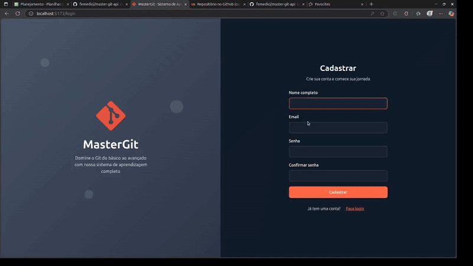

# MasterGit: Aprendizagem sobre Versionamento com uso da tecnologia Git


 Objetos de Aprendizagem — Mestrado   
 Autor:  Felipe Augusto Medici de Oliveira — _RA 2458772_  
 Proposta de Objeto de Aprendizagem (OA) 

---

## Objetivo do sistema:

Sistema para aprendizagem do controle de git. Onde o usuario ve seu progresso pelos modulos e atua com testes e validacoes do seu progresso.

## 🎬 Demonstração da Aplicação



> **Demonstração interativa**: Sistema de aprendizagem com módulos progressivos, sessões expandíveis, testes interativos e relatório final de desempenho com análise personalizada.

### 🛠️ Tecnologias Utilizadas:

- **Frontend**: React 18 + TypeScript + Vite
- **Styling**: Styled Components + CSS-in-JS
- **Ícones**: Lucide React (biblioteca moderna de ícones)
- **Roteamento**: React Router DOM (SPA navigation)
- **Estado**: React Hooks + Context API
- **Build**: Vite (hot reload + otimizações)
- **Persistência**: LocalStorage API

## Mapa Conceitual (CMAP):

_No cmap - pasta /grupo33_


## Modelo Instrucional:


## Objetivos Educacionais

O  MasterGit  é um objeto de aprendizagem (OA) interativo para desenvolvimento de domínio  conceitual e prático  do Git como sistema de controle de versão distribuído.

### Público-Alvo

 Primário: 

- Estudantes de  Computação  (Ciência da Computação, Engenharia de Software)
- Estudantes de  Engenharias  (Elétrica, Mecatrônica, Produção) com foco em automação
-  Profissionais de desenvolvimento  iniciantes e intermediários
-  Pesquisadores  que necessitam de controle de versão para experimentos

 Secundário: 

- Analistas de sistemas e QA
- Gerentes de projeto técnicos
- Estudantes de pós-graduação em áreas correlatas

 Pré-requisitos: 

- ✅ Noções básicas de linha de comando (CLI)
- ✅ Conhecimento básico de sistemas operacionais
- ✅ Experiência mínima com editores de texto/código

### Requisitos de Aprendizagem

Ao concluir o  MasterGit , o estudante será capaz de:

####  Competências Conceituais 

- Explicar o  modelo mental do Git  (objetos, commits, branches, HEAD, working tree, index)
- Diferenciar e aplicar `git checkout`, `git switch` e `git restore` adequadamente
- Compreender  estratégias de branching  (Git Flow, GitHub Flow, Trunk-Based)

####  Competências Práticas 

- Aplicar  fluxos de branching  (feature, release, hotfix) com segurança
- Diagnosticar e resolver  conflitos de mesclagem  documentando o raciocínio
- Projetar  estratégias de versionamento  adequadas a contextos específicos
- Operacionalizar  colaboração : pull requests, code reviews, semantic commits

####  Competências Avançadas 

- Avaliar  riscos e trade-offs  de decisões de versionamento
- Garantir  reprodutibilidade  de experimentos científicos com branches e tags
- Implementar  automação de releases  e changelogs
- Auditar históricos de commits para conformidade e qualidade

---

## - Como Rodar o Projeto:

### Pré-requisitos

- Node.js (versão 16 ou superior)
- Yarn ou npm

### Instalação e Execução

```bash
# Instalar dependências
yarn install

# Executar em modo desenvolvimento
yarn dev

# Build para produção
yarn build
```

### 📁 Estrutura do Projeto

```
src/
├── components/          # Componentes reutilizáveis
│   ├── CompletionModal.tsx  # Modal de conclusão com relatório
│   ├── Header.tsx          # Cabeçalho da aplicação
│   └── Sidebar.tsx         # Menu lateral de navegação
├── pages/              # Páginas principais
│   ├── LoginPage.tsx       # Página de autenticação
│   ├── MainLayout.tsx      # Layout SPA principal
│   ├── ModulesPage.tsx     # Lógica dos módulos (sessões)
│   ├── TestPage.tsx        # Wrapper para testes
│   └── content/           # Componentes de conteúdo
├── services/           # Lógica de negócio
│   ├── dataService.ts      # Gerenciamento de dados e persistência
│   └── mockedData/        # "Banco de dados" mockado
└── types/             # Definições TypeScript
    └── index.ts           # Interfaces e tipos
```

## Documentação Completa

Para requisitos detalhados, consulte: [`requisitosDoc.md`](./requisitosDoc.md)

---

## Funcionalidades Implementadas:

- [x] Sistema de autenticação
- [x] Dashboard com progresso visual
- [x] Módulos interativos com sessões expandíveis
- [x] Sistema de testes com múltiplos tipos de questões
- [x] Persistência de progresso local
- [x] Modal de conclusão com relatório detalhado
- [x] Navegação SPA fluida
- [x] Design responsivo
- [x] Animações e transições suaves

## Contexto Acadêmico

Este projeto foi desenvolvido como **Objeto de Aprendizagem (OA)** para o Mestrado em Ciência da Computação, focando em metodologias ativas de ensino para o domínio de ferramentas de versionamento.

### Métricas do Projeto:
- **3 Módulos** progressivos de aprendizagem
- **9 Sessões** interativas com conteúdo prático
- **15+ Questões** de teste com diferentes tipos
- **100% TypeScript** para type safety
- **Responsive Design** para diferentes dispositivos

---

<div align="center">

**MasterGit** - Domine o Git do básico ao avançado 🚀

*Desenvolvido por Felipe Augusto Medici de Oliveira*

</div>
