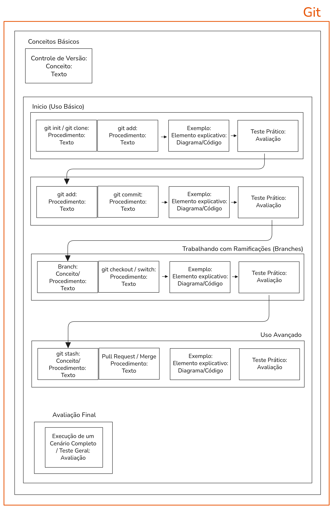
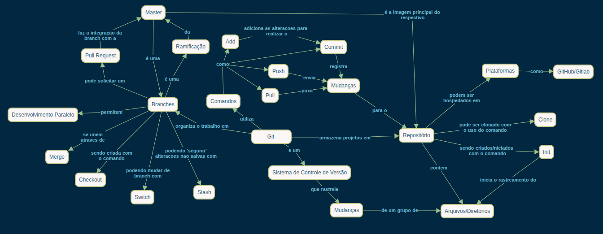

# Objeto de Aprendizagem: "MasterGit - Dominando o Controle de Versão"

---

Link para Video Aula: //

---

## Descrição Geral

Este objeto de aprendizagem consiste em uma Aplicação Web Interativa (SPA), com o objetivo de ensinar o estudante a utilizar e compreender o funcionamento do sistema de controle de versão Git. O conteúdo é apresentado por meio de módulos progressivos que combinam teoria, um terminal simulado para prática de comandos e um visualizador gráfico que demonstra em tempo real as alterações nos estados do Git (Working Directory, Staging Area, Repository).

## Público-Alvo

O objeto de aprendizagem é destinado a:

- **Estudantes de Computação** (Ciência da Computação, Engenharia de Software) que necessitam dominar ferramentas de versionamento.
- **Profissionais de desenvolvimento** iniciantes que buscam uma compreensão visual e prática do fluxo de trabalho do Git.
- **Educadores** que desejam utilizar uma ferramenta visual para explicar conceitos abstratos de versionamento de código.

**Pré-requisitos esperados:**

- Noções básicas de linha de comando (CLI).
- Conhecimento básico de sistemas operacionais (arquivos e pastas).
- Experiência mínima com edição de texto/código.

## Requisitos de Aprendizagem

Ao concluir os módulos do sistema, o estudante deverá ser capaz de:

- **Compreender o modelo mental do Git**, diferenciando as áreas de trabalho (Local, Staging, Remoto).
- **Executar comandos essenciais** como `git init`, `git add`, `git commit`, `git clone` e `git branch`.
- **Gerenciar ramificações (branches)**, compreendendo como criar, alternar e fundir (merge) históricos de código.
- **Resolver cenários práticos**, aplicando a sequência correta de comandos para atingir objetivos de versionamento.

## Estrutura do Objeto de Aprendizagem

O sistema segue uma estrutura modular e linear, conforme o diagrama instrucional:

1.  **Módulo 1 – Conceitos Básicos**: Introduz o Git, clonagem, inicialização de repositórios e o ciclo básico de commit.
2.  **Módulo 2 – Ramificações (Branches)**: Explica o conceito de desenvolvimento paralelo, criação e troca de branches.
3.  **Módulo 3 – Avançado**: Aborda fusão de código (merge) e gerenciamento de mudanças temporárias (stash).
4.  **Avaliação Prática (Cenários)**: Ao final de cada módulo, um teste de caso prático é liberado, onde o aluno deve resolver um problema completo sem assistência guiada.

## Uso do Objeto

O sistema dispõe de 3 módulos, onde cada módulo possui passos específicos a serem completados. A conclusão de um módulo libera o acesso ao próximo.

Ao finalizar os passos de um módulo, é liberado o teste final. Trata-se de um teste de caso completo, onde é apresentado um cenário para o usuário executar uma sequência de comandos, resolvendo o problema proposto com os conhecimentos obtidos.

Em cada módulo, a interface apresenta a parte de código, que simula um console/terminal para entrada de comandos, e a parte ilustrativa, que demonstra visualmente as ações realizadas.

## Competências Desenvolvidas

- Compreensão dos conceitos fundamentais do Git (commits, branches, merge, stash).
- Capacidade de operar via linha de comando (CLI) para gerenciamento de projetos.
- Habilidade para diagnosticar e resolver situações de versionamento complexas.
- Preparação para atuar em equipes de desenvolvimento utilizando boas práticas de mercado.

## Tecnologias Envolvidas

- **React 18 + TypeScript**: Para a construção da interface interativa e lógica de estado.
- **Vite**: Para build e otimização da aplicação.
- **Framer Motion**: Para as animações didáticas do visualizador.
- **Lucide React**: Para a iconografia moderna.

## Guia de Instalação

Para configurar o ambiente corretamente e executar o objeto de aprendizagem localmente, é necessário ter o Node.js instalado.

O passo a passo detalhado encontra-se disponível no arquivo de guia:

**[Guia de Instalação](./GUIA_DE_INSTALACAO.md)**

## Modelo Instrucional e Plano de Aula

Para educadores e interessados na fundamentação pedagógica deste objeto, disponibilizamos a documentação completa:

- [Plano de Aula](./api/public/planoAula.pdf)

## Avaliação do Aprendizado

O aprendizado é avaliado automaticamente pelo sistema em dois níveis:

1.  **Formativa (Passo a Passo)**: O sistema valida cada comando inserido no terminal simulado, fornecendo feedback imediato e visualização do resultado.
2.  **Somativa (Cenários)**: Nos testes finais de cada módulo, o aluno deve completar uma missão complexa (ex: "Configure o repo e crie uma feature branch"). O sistema verifica o estado final do ambiente simulado para aprovar a conclusão.

## Mapa Conceitual

---

**Autor**: Felipe Augusto Medici de Oliveira — _RA 2458772_
